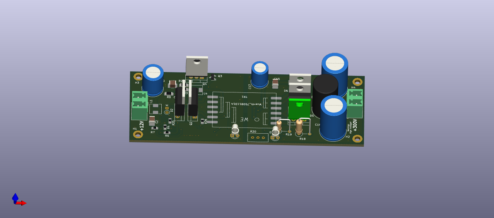

# Isolated 12VDC to 300VDC SMPS

This project is about finding a power supply to drive regular 240VAC/120VAC
LED bulbs from a 12V power supply or 12V battery.

This is the first prototype build using the [LTC3723](https://www.analog.com/media/en/technical-documentation/data-sheets/372312f.pdf).

It features:
- Up to 24 Watts
- LC input filter
- Galvanic isolation
- Adjustable output voltage (for development only)

## Analysis

*TBD*

## Schematics

## Safety advice

    Design, installation and inspection of machinery and devices carrying high voltage
    require accordingly trained and qualified personnel.
    Appropriate safety rules and directives must be complied with.
    Improper handling of high voltage can mean severe injuries or death and may cause
    serious collateral damage! 

## Disclaimer

    THE OPEN SOURCE SOFTWARE/HARDWARE IN THIS PROJECT IS DISTRIBUTED
    IN THE HOPE THAT IT WILL BE USEFUL, BUT WITHOUT ANY WARRANTY, WITHOUT
    EVEN THE IMPLIED WARRANTY OF MERCHANTABILITY OR FITNESS FOR A
    PARTICULAR PURPOSE.
