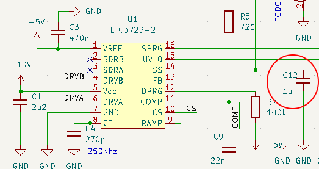

# Soft-start

The soft-start mechanism slowly charges the secondary side capacitor until
it reaches the intended output voltage. This is mandatory as the transformer
only operates within it's expected boundaries when the output caps are
fully charged.

The soft-start capacitor `C12` is slowly charged by the LTC3723. The voltage
accross the softstart capacitor determines the duty-cycle and thus is low at
startup.

As the secondary side voltage is 0V at startup the transformer sees a short
circuit on the output and the only active inductance is the leakage inductance.

To limit the current on start-up a seconday mechanism was used in addition to
the lower duty-cycles. Two resistors, `R4` and `R24`, were used to limit the
primary side current under heavy load conditions.

Those resistors are bridged by the PMOS `Q4` once the softstart voltage has
reached it's final level:

The soft-start capacitor is slowly charged until it reaches 5V.

## 1uF soft-start capacitor:

**Results**

Soft-start ramp time: 335 msec
Soft-start low level: 330mV
Soft-start high level: 5000mV

## 6.8uF soft-start capacitor:

**Results**

Soft-start ramp time: 1900 msec
Soft-start low level: 460mV
Soft-start high level: 48000mV

## soft-start switching start

The LTC3723 starts switching after the soft-start voltage has reached a specific
level. Here it is 680mV before it start's switching:

This behaviour can be explained by looking at the LTC3723-2 internals. It adds
650mV to the RAMP signal, thus the SS voltage must be more than 650mV to generate
a duty cycle > 0.

## soft-start vs output voltage

**When there's no load connected at the secondary side:**

It takes about 900msec to fully charge the secondary side.

**When there's a "9W LED bulb" connected at the secondary side output:**

It takes about 700msec to fully charge the secondary side.

*TODO: Improve soft-start and charge secondary side faster if possible.*